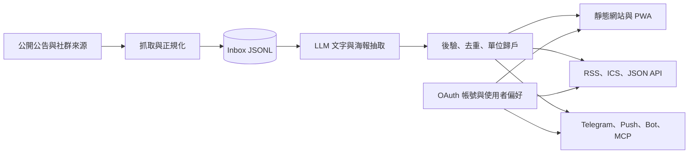
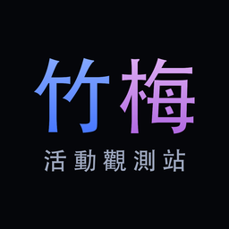
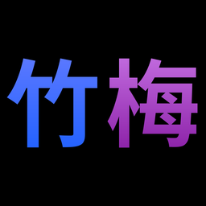
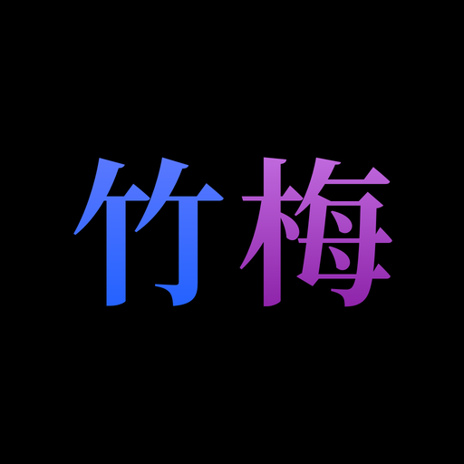
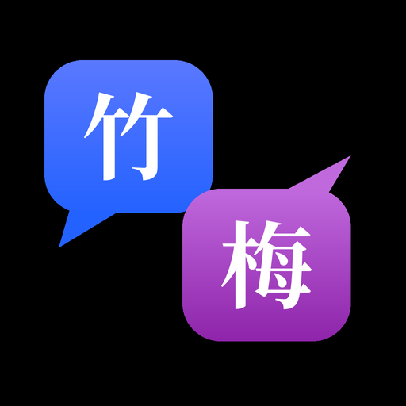

<p align="center">
  <a href="https://chumei.observe.tw/">
    
  </a>
</p>

<h1 align="center">竹梅活動觀測站</h1>

<p align="center">
  清大 × 陽明交大校園活動自動彙整<br>
  從公開公告與社群貼文整理活動，提供網站、推播、行事曆、RSS、Bot 與 AI 查詢介面。
</p>

<p align="center">
  <a href="https://chumei.observe.tw/"></a>
  <a href="https://chumei.observe.tw/status/"></a>
  <a href="LICENSE"></a>
</p>

<p align="center">
  <a href="https://chumei.observe.tw/events/">瀏覽活動</a> ·
  <a href="https://chumei.observe.tw/subscribe/">自訂訂閱</a> ·
  <a href="https://chumei.observe.tw/notify/">App 通知</a> ·
  <a href="https://chumei.observe.tw/source/">資料來源</a> ·
  <a href="https://t.me/chumei_events">Telegram</a>
</p>

「竹梅」取自梅竹賽的梅（清華，梅貽琦）與竹（交大，凌竹銘），倒過來唸——都有梅竹了，怎麼能沒有竹梅呢？

## 功能

- **活動與貼文河道**：首頁貼文河道，以及地圖、列表、日曆三種活動檢視；活動地點可對應校園建築座標。
- **470+ 單位名錄**：[/source/](https://chumei.observe.tw/source/) 收錄校方、系所、社團與校外主辦，每個單位有自己的活動、貼文與例行時段頁面。
- **帳號系統**：支援陽明交大 OAuth 與 Google 登入，可互相綁定；提供公開個人頁、追蹤單位、「我要去」、回報紀錄與跨裝置同步。
- **自訂行事曆與 RSS**：依學校、類型、校區、主辦自由組合。登入後可儲存最多 10 組具名訂閱，加入「只看我追蹤的單位」，並管理、換發私密網址。
- **Web Push／PWA**：網站可安裝成 App，依學校、類型、追蹤單位與關鍵字推送；「我要去」活動可在前一天提醒。
- **Telegram 與查詢 Bot**：[Telegram 頻道](https://t.me/chumei_events) 發布新活動；私訊 [@chumei_events_bot](https://t.me/chumei_events_bot) 可用「這週末 清大」「熱舞社」等自然語句搜尋。
- **AI／開發者介面**：提供 JSON API 與 Streamable HTTP MCP server（`https://chumei.observe.tw/mcp`），讓支援 MCP 的 AI 助理搜尋活動、查名錄與建立訂閱網址。
- **限時動態牆**：輪播兩校公開 Instagram 限時動態，保留足夠時間讓使用者補看校園消息。

## 資料來源與處理原則

竹梅只彙整公開資訊，主要來源包括：

- 陽明交大公告、清大各單位 RPage、WordPress 網站與 [NYCU LIFE](https://events.life.nycu.edu.tw/) 官方活動 API。
- 學生社團與校方單位的 Instagram、Facebook、Threads、X 公開貼文；名冊位於 `data/sources/`，以兩校官方社團名冊為底。
- Instagram 公開限時動態。

活動時間、地點、報名方式與例行社課時段由 LLM 從貼文文字及海報擷取，再經程式後驗、來源歸戶與跨來源去重。資訊不足或信心偏低的結果會標示「待確認」；實際資訊仍以主辦單位原始公告為準。

## 系統流程



## Repository 結構

| 路徑 | 用途 |
| --- | --- |
| `data/sources/*.csv` | 人工維護的社團、單位、社群帳號、公告站與場地座標名冊 |
| `data/feeds/inbox/` | 各來源 adapter 正規化後的 JSONL |
| `scripts/fetch_*.py` | 公告、Instagram、Facebook、Threads、X、WordPress 與限動抓取器 |
| `scripts/extract_events.py` | LLM 活動判別、文字／海報欄位抽取與快取 |
| `scripts/build_site.py` | 合併、去重、單位歸戶、場地定位，產生網站、feeds 與 API |
| `scripts/auth_server.py` | OAuth、Session、個人頁、「我要去」、回報與帳號型自訂訂閱 |
| `scripts/push_server.py` | Web Push 訂閱 API 與帳號綁定 |
| `scripts/publish_push.py` | 依偏好滴灌新活動與「我要去」提醒 |
| `scripts/publish_telegram.py` | 以原始貼文為單位發布 Telegram 訊息 |
| `scripts/bot_core.py` | Telegram／LINE 共用的自然語句活動查詢核心 |
| `scripts/mcp_server.py` | 唯讀 MCP server，資料源為 `site/` 建站產物 |
| `scripts/run_pipeline.py` | 定期抓取、抽取、建站與發布的 orchestrator |
| `site/` | Caddy 直接提供的靜態網站產物與品牌資產 |
| `deploy/` | macOS launchd 服務定義 |
| `docs/SCHEMA.md` | Inbox 與抽取資料格式 |

## 本機開發

```sh
python3 -m venv .venv
.venv/bin/pip install -r requirements.txt
cp .env.example .env
```

在 `.env` 填入開發需要的金鑰後，可執行完整 pipeline，或只重新建站：

```sh
.venv/bin/python scripts/run_pipeline.py
.venv/bin/python scripts/build_site.py
python3 -m http.server -d site 8899
```

執行完整測試：

```sh
.venv/bin/python -m unittest discover -s tests -v
```

正式環境的密鑰只存在被 Git 忽略的 `.env` 或 macOS Keychain；請勿把 OAuth secret、Telegram token、社群 cookie 或 `state/` 內的使用者資料提交到 repository。

## 帳號與自訂訂閱

### OAuth

NYCU OAuth Authorization Code 應用程式的 callback：

```text
https://chumei.observe.tw/auth/nycu/callback
```

Google OAuth 2.0 Web application 的 callback：

```text
https://chumei.observe.tw/auth/google/callback
```

開發環境可在 `.env` 設定：

```sh
CHUMEI_NYCU_OAUTH_CLIENT_ID=
CHUMEI_NYCU_OAUTH_CLIENT_SECRET=
CHUMEI_GOOGLE_OAUTH_CLIENT_ID=
CHUMEI_GOOGLE_OAUTH_CLIENT_SECRET=
CHUMEI_AUTH_PUBLIC_BASE_URL=https://chumei.observe.tw
CHUMEI_FEED_SIGNING_KEY=
```

正式機使用以下 Keychain services：

| 用途 | Keychain service |
| --- | --- |
| NYCU Client ID | `tw.observe.chumei.nycu-oauth-client-id` |
| NYCU Client Secret | `tw.observe.chumei.nycu-oauth-secret` |
| Google Client ID | `tw.observe.chumei.google-oauth-client-id` |
| Google Client Secret | `tw.observe.chumei.google-oauth-secret` |
| 自訂訂閱簽章金鑰 | `tw.observe.chumei.feed-signing-key` |

兩種登入可在帳號頁互相綁定。若該身分已有帳號，系統會把追蹤、參加標記、回報、已儲存訂閱與 Session 合併到目前帳號；解除綁定時至少保留一種登入方式。

### 頁面與 Feed

- `/account/`：帳號設定、登入方式、行事曆、回報與自訂訂閱管理。
- `/@handle`：可由使用者關閉的公開個人頁。
- `/auth/calendar/{token}.ics`：「我要去」活動的私密行事曆，可由帳號頁換發。
- `/feeds/custom.ics`、`/feeds/custom.xml`：不需登入的多維條件組合。
- `/feeds/s/{signed-token}.ics`、`.xml`：帳號儲存的私密訂閱；修改條件不更換網址，除非使用者主動換發。

`CHUMEI_FEED_SIGNING_KEY` 未另外設定時，服務會從 NYCU OAuth client secret 做用途隔離後衍生簽章金鑰；資料庫只保存 public ID，不保存可直接使用的完整 signed token。

帳號服務由 `deploy/tw.observe.chumei.auth.plist` 常駐在 `127.0.0.1:8324`。Caddy 需將 `/auth/*`、`/account*`、`/@*`、`/feeds/custom.*` 與 `/feeds/s/*` 反代到該服務。

## 推播、Telegram 與抓取排程

- Telegram publisher 以 `CHUMEI_TELEGRAM_ENABLED=true` 啟用；正式發送前可執行 `scripts/publish_telegram.py --check` 與 `--dry-run`。
- Instagram 支援 `rsshub` 與 `instaloader` 兩個後端；`auto` 會先嘗試 RSSHub，失敗時在該輪切換到 instaloader。
- Instagram 帳號採持久化分批排程與 jitter，遇到 401／429 會停止該批並指數退避；狀態保存在被 Git 忽略的 `state/`。
- 首次正常執行會把現有近期活動設為 baseline，避免洗版；後續每輪 pipeline 最多推送 10 則，22:00–07:59 靜音。
- Web Push 偏好與帳號追蹤跨裝置同步；發布器每 30 分鐘檢查新活動與隔日「我要去」提醒。

## 登入回報活動

登入者可從 [/submit/](https://chumei.observe.tw/submit/) 或帳號頁提交活動／帳號連結。`scripts/process_submissions.py` 會定期：

1. 比對既有來源名冊、Inbox 與活動資料。
2. 對未收錄內容擷取 Open Graph、正文或截圖。
3. 交由既有抽取流程判斷新活動、既有活動、不相關內容或人工確認。
4. 把狀態寫回帳號資料庫，讓回報者查看處理結果。

每人每日最多 10 筆，相同連結會去重。可公開驗證的學校單位或社團帳號會進入來源審核流程。

## 品牌資產

<table>
  <tr>
    <td align="center"><br><code>logo-square-*.png</code></td>
    <td align="center"><br><code>logo-mark-*.png</code></td>
    <td align="center"><br><code>logo-bot-*.png</code></td>
    <td align="center"><br><code>logo-chat-*.png</code></td>
  </tr>
</table>

- 完整 Open Graph 預覽圖：`site/assets/og-default.png`（1200 × 630）
- PWA／Apple Touch Icon：`site/assets/brand/logo-square-*.png`
- Favicon：`site/assets/favicon.svg` 與 `site/assets/brand/logo-mark-*.png`
- 品牌字型：`site/assets/fonts/chumei-brand*.woff2`

## 資料回報、下架與 License

活動資訊有誤、主辦單位希望調整或下架，可從網站登入後回報，或寄信至 [chumei@observe.tw](mailto:chumei@observe.tw)。GitHub [Issues](../../issues) 僅處理程式問題；轉載的海報與貼文均附原始來源，主辦單位要求即下架。

程式碼採用 [MIT License](LICENSE)；活動內容版權屬各主辦單位。
